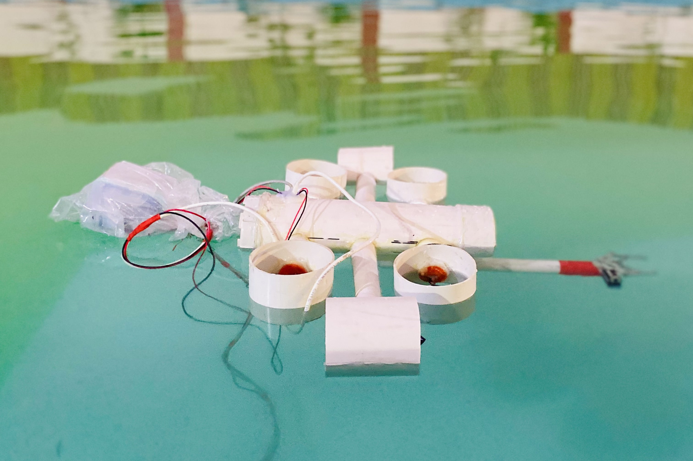
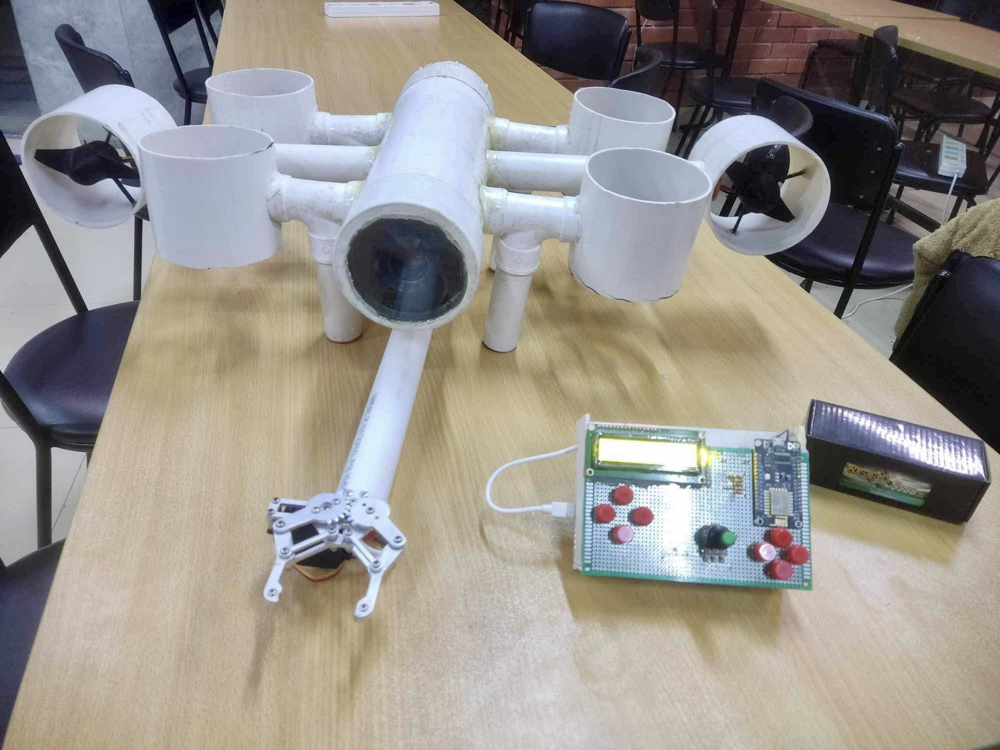
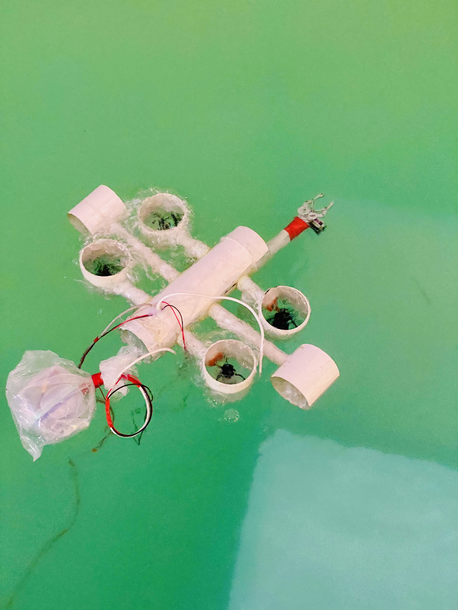
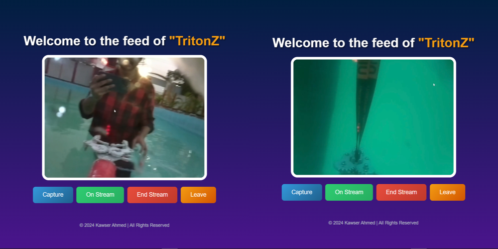

# 🌊 **TritonZ: A Remotely Operated Underwater Rover**  
### 🚀 **Designed for Exploration and Rescue Operations**  

Welcome to the repository for **TritonZ**, a cutting-edge **Remotely Operated Underwater Rover (ROV)** equipped with a versatile manipulator arm for underwater exploration and rescue tasks. This project was proudly developed as part of our **Microprocessors & Microcontrollers Laboratory Course**, under the supervision of **Mr. Fahim Hafiz Sir**.  

---

<p align="center">
  
</p>

---

## 🌟 **Key Features**  
💡 **Project Proposal**: Objectives and the vision behind TritonZ.  
🔧 **Codebase**: Source code for microcontrollers and processors.  
⚙️ **Implementation**: Hardware integration, software design, and testing.  
🤖 **Manipulator Arm**: A functional arm for precise rescue tasks.  
📑 **Reports**: Comprehensive documentation of design, challenges, and solutions.  

---

## 📹 **Demo Video & Project Gallery**  

🎥 **Watch TritonZ in Action!**  
[👉 Click Here to View Demo](https://drive.google.com/drive/folders/1yjFC9lKnV3xkS42XfZ750D8-EzUNAV0f)  

### 📸 **Project Images**  
- 3D Design of ROV  
- Manipulator Arm in Action  
- Underwater Testing Footage  

<p align="center">
  
  
  
</p>

---

## 🛠️ **System Architecture**  

### **⚙️ Hardware Overview**  
TritonZ integrates robust components for efficient underwater operations:  
- **Main Controller**: Raspberry Pi 3 B+  
- **Camera**: Pi Cam for live video feed  
- **Manipulator Arm**: Controlled by servo and stepper motors  
- **Motors**:  
  - 4x BLDC Motors for thrust  
  - 2x BLDC Motors for directional control  
- **Other Components**:  
  - ESP-8266 for wireless communication  
  - PVC Frame and Epoxy for a waterproof design  

### **🖥️ Software Overview**  
Our multi-tier software architecture includes:  
- **Sensor Feedback**: Real-time data from Pi Cam and onboard sensors.  
- **Motor Control**: Thrust and directional motors controlled via Raspberry Pi and Arduino Mega.  
- **Manipulator Arm**: Logic for object handling and rescue operations.


### **🖥️ Live Feed from Pi Cam**  
<p align="center">
  
</p>


---

## 📖 **How to Run**  

### 🔍 **Clone the Repository**  
```bash
git clone https://github.com/kawser-ahmed-byte/Microprocessors-and-Microcontrollers-Laboratory-Project-UAV.git
cd Microprocessors-and-Microcontrollers-Laboratory-Project-UAV

### 🛠️ **Install Dependencies**
 1. Install necessary Python libraries for Raspberry Pi:
    pip install -r requirements.txt
 2. Upload the Arduino .ino files using the Arduino IDE.

### 🚀 ***Run the System**
 1. Connect the hardware: Ensure motors, sensors, and arm components are wired correctly.
 2. Launch the Python script to initiate the control system:
    python main.py


## 🧩 Technologies Used

|  **Component**     | **Description**                              |
|--------------------|-------------------------------------------   |
| **Raspberry Pi**   | Main controller for video streaming & logic. |
| **Arduino Mega**   | Handles motor and manipulator arm logic.     |
| **ESP-32/8266**    | Wireless communication.                      |
| **BLDC Motors**    | Thrust for underwater navigation.            |
| **Pi Cam**         | Captures live video for monitoring.          |
| **Servo Motors**   | Controls the manipulator arm.                |

---

## 🤝 Contributors

This project was collaboratively developed by students of **United International University (UIU), Bangladesh**:  
- **Kawser Ahmed**  
- **Mir Shahriar Fardin**  
- **Arif Faysal Nayeem**  

---

## 📚 Acknowledgments

We extend our gratitude to **Fahim Hafiz sir** for his guidance and support and to **UIU** for enabling us to explore innovative applications in underwater robotics.

---

## 📬 Contact
💌 Email: kawserahmd2001@gmail.com
❓ Have feedback or questions? Feel free to open an issue in this repository.
